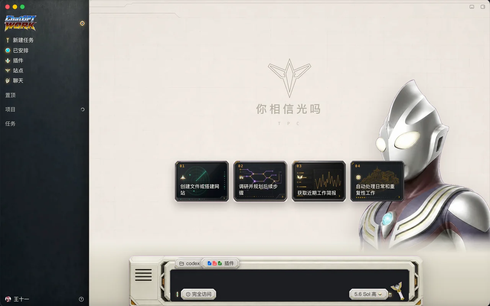
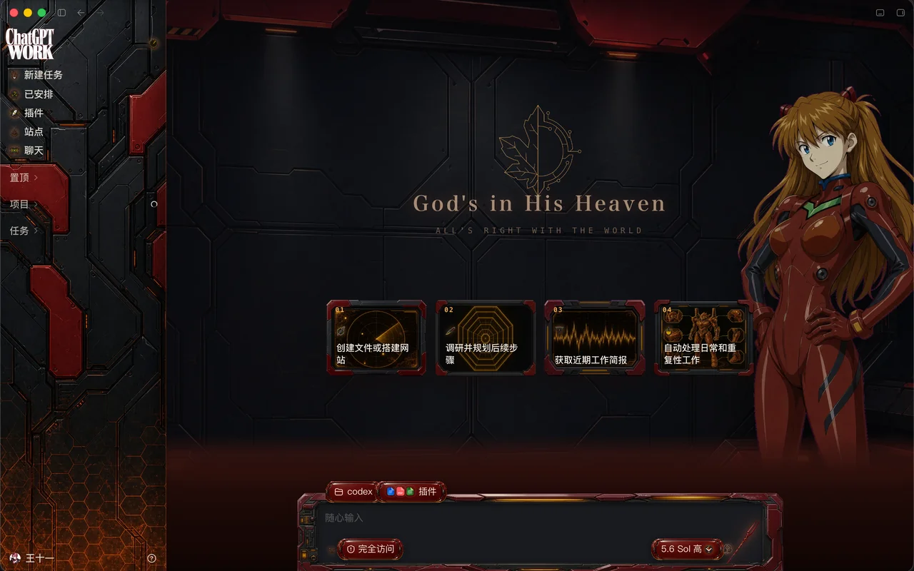
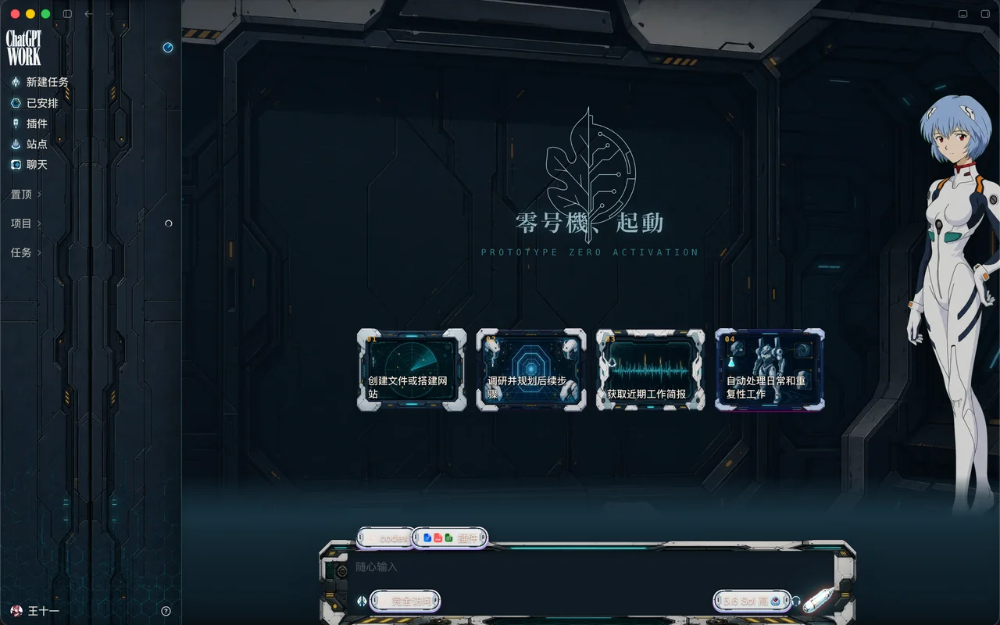
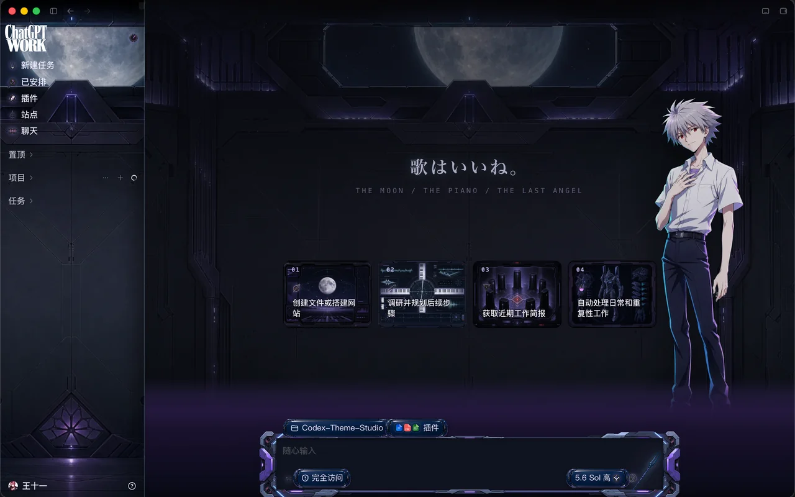
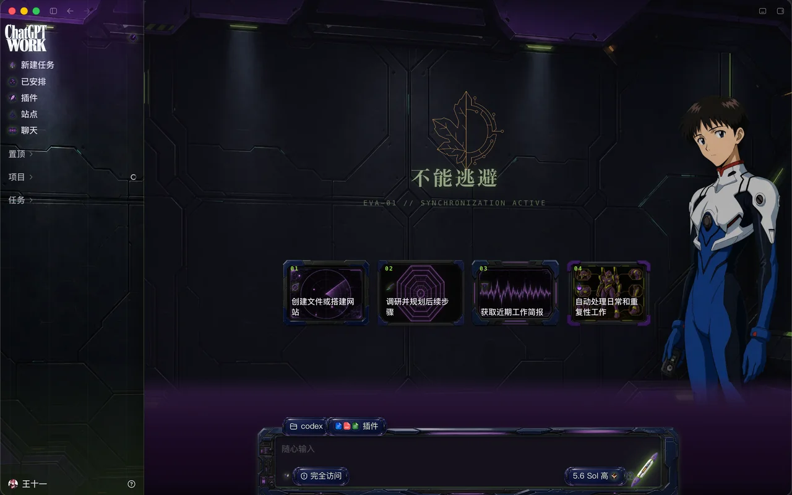

<h1 align="center">Awesome Codex Skins</h1>

<p align="center">
  <b>The <code>.codexskin</code> standard, toolchain & gallery</b><br>
  官方 Codex 桌面应用的素材化 UI 皮肤：标准、工具链与画廊。CDP 实时注入——不改应用文件、签名完好、一条命令完全还原。<br>
  Asset-based UI themes for the official OpenAI Codex desktop app, injected live over CDP — no app files touched, signature intact, one command to revert.
</p>

<p align="center">
  <a href="https://github.com/Wangnov/awesome-codex-skins/releases/latest"></a>
  <a href="https://github.com/Wangnov/awesome-codex-skins/actions/workflows/validate-skins.yml"></a>
  <a href="https://github.com/Wangnov/awesome-codex-skins/stargazers"></a>
  <a href="https://github.com/Wangnov/Codex-App-Manager"></a>
  <a href="./SPEC.md"></a>
  <a href="./LICENSE"></a>
</p>

<p align="center">
  <a href="#readme-cn"><b>中文</b></a> · <a href="#readme-en"><b>English</b></a> · <a href="./SPEC.md">SPEC</a> · <a href="./REGISTRY.md">Registry</a> · <a href="./DISCLAIMER.md">Disclaimer</a>
</p>

---

<a id="readme-cn"></a>

# 中文

> **每一张预览都是注入后运行中 Codex 的真机截图，经自动化质量门产出——没有效果图，没有概念稿。**

## 画廊

| | |
|:---:|:---:|
|  **TPC GUTS 指挥终端** `guts-terminal` — 迪迦奥特曼 TPC/GUTS 指挥台 |  **NERV 二号机 · 明日香** `asuka-eva02` — 剃刀警示纹与骑士红 |
|  **NERV 零号机 · 绫波丽** `rei-eva00` — 淡蓝 LCL 的静谧 |  **Mark.06 · 渚薰** `kaworu-mark06` — 月夜与 SEELE 色调 |
|  **NERV 初号机 · 碇真嗣** `shinji-eva01` — 测试型紫绿 | *你的皮肤 —— 见[投稿收录](#投稿收录)* |

## 使用皮肤

**方式 A —— [Codex App Manager](https://github.com/Wangnov/Codex-App-Manager)（推荐）**
桌面管理器内置皮肤画廊：一键**试穿**（运行中的 Codex 秒级热切换）、**应用**（持久生效，含原生 accent/字体配置）、完全还原；从 [Releases](https://github.com/Wangnov/awesome-codex-skins/releases/latest) 下载 `.codexskin` 拖入主题页即装。

**方式 B —— studio CLI（本仓库）**

```bash
git clone https://github.com/Wangnov/awesome-codex-skins
cd awesome-codex-skins/studio
node bin/codex-theme.mjs start --theme guts-terminal   # 以调试模式启动 Codex 并注入
node bin/codex-theme.mjs use rei-eva00                 # 热切换，无需重启
node bin/codex-theme.mjs off                           # 即刻还原原生
```

要求：macOS、Node ≥ 20、官方 Codex.app。Windows 支持随 [Codex App Manager](https://github.com/Wangnov/Codex-App-Manager) 演进。

## 制作皮肤

仓库内置完整生产线——把一张概念图/一种 IP 风格做成成品 `.codexskin` 的 Agent Skill，**Claude Code 与 Codex 通用**（纯 SKILL.md，无需插件）：

```bash
# Claude Code
cp -r skills/codex-theme-maker ~/.claude/skills/
# Codex：同样放入你的 skills 目录
```

然后对你的 Agent 说：「做一个 XX 风格的 Codex 皮肤」。Skill 全程驱动：素材生成（品红底抠图、alpha 门禁）→ 按 DOM 配方组装 CSS → CDP 实时迭代 → 结构化验收 → `pack` 交付质量门。详见 [skills/codex-theme-maker/SKILL.md](skills/codex-theme-maker/SKILL.md) 与 [SPEC.md](SPEC.md)。

## 投稿收录

投稿即 PR：提交 `skins/<id>/` 源目录（非仅压缩包），CI 自动运行与本地一致的 `pack` 质量门——schema、素材预算、真机截图预览、`version`/`codexVerified` 齐备。

| 分级 | 含义 |
|---|---|
| **Certified** | CI 绿 **+** 维护者真机验证 |
| **Community** | CI 绿（格式合规），尚未人工抽验 |

完整列表见 [REGISTRY.md](REGISTRY.md)。

## 规范与原则

- [SPEC.md](SPEC.md) —— `.codexskin` 格式、硬限制、预览标准、质量门
- [DISCLAIMER.md](DISCLAIMER.md) —— 非官方声明、同人授权、下架机制
- 核心原则：**素材化 UI 而非调色盘**、文字全部是活的 DOM、完全可逆、零交互拦截、预览必须真机可验证

---

<a id="readme-en"></a>

# English

> **Every preview is a real screenshot of a themed, running Codex, produced under an automated quality gate. No mockups, no concept art.**

## Gallery

| | |
|:---:|:---:|
|  **TPC GUTS Command Terminal** `guts-terminal` — Ultraman Tiga command deck |  **NERV EVA-02 Asuka** `asuka-eva02` — hazard stripes & knight red |
|  **NERV EVA-00 Rei** `rei-eva00` — pale-blue LCL calm |  **Mark.06 Kaworu** `kaworu-mark06` — moonlit SEELE tones |
|  **NERV EVA-01 Shinji** `shinji-eva01` — Test Type purple/green | *Your skin here — see [Contributing](#contributing)* |

## Use a skin

**Option A — [Codex App Manager](https://github.com/Wangnov/Codex-App-Manager) (recommended)**
The desktop manager ships a skin gallery: one-click **try-on** (live hot-swap on a running Codex), **apply** (persistent, incl. native accent/font config), full restore; grab a `.codexskin` from [Releases](https://github.com/Wangnov/awesome-codex-skins/releases/latest) and drag it into the theme page to install.

**Option B — studio CLI (this repo)**

```bash
git clone https://github.com/Wangnov/awesome-codex-skins
cd awesome-codex-skins/studio
node bin/codex-theme.mjs start --theme guts-terminal   # launch Codex (loopback CDP) + inject
node bin/codex-theme.mjs use rei-eva00                 # hot-swap, no restart
node bin/codex-theme.mjs off                           # back to stock, instantly
```

Requirements: macOS, Node ≥ 20, official Codex.app. Windows support tracks [Codex App Manager](https://github.com/Wangnov/Codex-App-Manager).

## Make a skin

The repo ships the full production line — an agent skill that takes a concept image / IP style all the way to a packed `.codexskin`, for **both Claude Code and Codex** (plain `SKILL.md`, no plugin required):

```bash
# Claude Code
cp -r skills/codex-theme-maker ~/.claude/skills/
# Codex — place it in your skills directory likewise
```

Then ask your agent: *"make me a Codex skin in the style of X"*. The skill drives asset generation (magenta-matte cutouts, alpha gates), CSS assembly against the DOM recipe book, live CDP iteration, a structural acceptance suite, and the final `pack` delivery gate. See [skills/codex-theme-maker/SKILL.md](skills/codex-theme-maker/SKILL.md) and [SPEC.md](SPEC.md).

## Contributing

Submissions are PRs adding `skins/<id>/` (source, not just the archive). The CI gate runs the same `pack` validation as local dev — schema, asset budgets, real-screenshot previews, `version`/`codexVerified` present.

| Tier | Meaning |
|---|---|
| **Certified** | CI green **+** maintainer verified on a real Codex |
| **Community** | CI green (format-valid), not yet hand-verified |

See [REGISTRY.md](REGISTRY.md) for the full list.

## Spec & principles

- [SPEC.md](SPEC.md) — the `.codexskin` format, hard limits, preview standard, quality gate
- [DISCLAIMER.md](DISCLAIMER.md) — unofficial status, fan-art licensing, takedown process
- Core principles: **asset-based UI, not a palette swap** · all text stays live DOM · fully reversible · zero interaction interception · previews are verified screenshots

---

*Unofficial project; not affiliated with OpenAI. IP-referencing skins are non-commercial fan art — see [DISCLAIMER.md](DISCLAIMER.md). 非官方项目，与 OpenAI 无关；涉及 IP 的皮肤均为非商业同人创作。*
